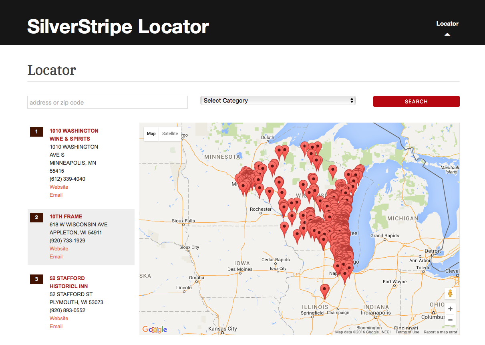

# SilverStripe Locator

SilverStripe Locator displays a filterable map of locations. You can choose whether to show all locations on load, or enable auto geocoding to filter the initial list based on the visitor's location. 

## Requirements

 * SilverStripe ^4.0
 * muskie9/data-to-arraylist ^2.0
 * dynamic/silverstripe-geocoder ^1.0
 * symbiote/silverstripe-gridfieldextensions ^3.0
 
## License

See [License](LICENSE.md)

## Installation

`composer require dynamic/silverstripe-locator 3.0.x-dev`

## Example usage

Displays a filterable list of locations on a map. Users can filter by address or category to find the location nearest them. 

With auto geocoding enabled in the CMS, the map will display the nearest 26 locations to the user.

 
## Documentation

See the [docs/en](docs/en/index.md) folder.

## Maintainers
 *  [Dynamic](https://www.dynamicagency.com) (<dev@dynamicagency.com>)
 
## Bugtracker
Bugs are tracked in the issues section of this repository. Before submitting an issue please read over 
existing issues to ensure yours is unique. 
 
If the issue does look like a new bug:
 
 - Create a new issue
 - Describe the steps required to reproduce your issue, and the expected outcome. Unit tests, screenshots 
 and screencasts can help here.
 - Describe your environment as detailed as possible: SilverStripe version, Browser, PHP version, 
 Operating System, any installed SilverStripe modules.
 
Please report security issues to the module maintainers directly. Please don't file security issues in the bugtracker.
 
## Development and contribution
If you would like to make contributions to the module please ensure you raise a pull request and discuss with the module maintainers.
